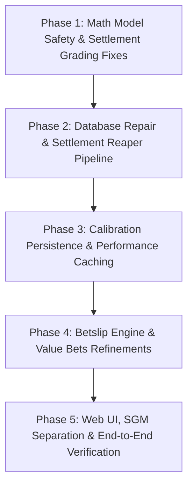

# Master Audit Remediation Plan: MatchPredictor

## Executive Summary
This implementation plan addresses all 15 critical, high, and medium issues identified during the comprehensive system audit and confirmed against the live Neon PostgreSQL production database. The remediation has been completely executed across five sequential, verified phases ensuring maximum stability, zero data corruption, and complete test coverage.

---

## Phase 1: Mathematical Model Safety & Settlement Grading Fixes (P0)

### Goal
Eliminate runtime division-by-zero crashes, erroneous settlement outcomes, and phantom 100% predictions at the mathematical root.

### Tasks

- [x] **1.1 Fix Under 2.5 Goals Settlement Inversion in `PredictionScoreClassHelper.cs`**
  - **File:** `MatchPredictor.Application/Helpers/PredictionScoreClassHelper.cs#L140-L150`
  - **Issue:** Switch expression only checked exact `"under"` / `"under 2.5"`. Display string `"Under 2.5 Goals"` hit default `_ => isOver`, inverting settlement (0-0 graded Lost, 3-3 graded Won).
  - **Action:** Updated `DoesOverPredictionMatch` to check `normalized.Contains("under")`.
  - **Verification:** Unit test asserting `"Under 2.5 Goals"` with score 0:0 returns `true`, and 3:3 returns `false`.

- [x] **1.2 Fix Straight Win Forecast Settlement Flaw in `AnalyzerService.Settlement.cs`**
  - **File:** `MatchPredictor.Application/Services/AnalyzerService.Settlement.cs#L1573-L1575`
  - **Issue:** `case PredictionMarket.StraightWin` returned `true` if `DetermineStraightWinOutcome(score)` was either `"Home Win"` or `"Away Win"`, marking a loss as a win when the opposing side won.
  - **Action:** Evaluated against directional outcomes (`HomeWin` / `AwayWin`) matching the predicted team.
  - **Verification:** Unit test asserting forecast Home Win with score 0:2 sets `OutcomeOccurred = false`.

- [x] **1.3 Fix Division-by-Zero and Negative Multiplier in `EloRatingModel.cs`**
  - **File:** `MatchPredictor.Infrastructure/Statistics/EloRatingModel.cs#L147-L149`
  - **Issue:** When underdog won with Elo gap $\ge 2200$, `(winnerRatingEdge * 0.001) + 2.2` reached 0 or became negative.
  - **Action:** Added a strict positive floor: `Math.Max(0.2, (winnerRatingEdge * 0.001) + 2.2)`.
  - **Verification:** Unit test with 2500 Elo difference victory asserting positive, bounded multiplier without `NaN` or `Infinity`.

- [x] **1.4 Guard Totals Predictions with Explicit Market Presence Check**
  - **Files:**
    - `MatchPredictor.Infrastructure/Services/DataAnalyzerService.cs#L95-L114`
    - `MatchPredictor.Infrastructure/Services/ProbabilityCalculator.cs#L58-L69`
  - **Issue:** Matches with missing totals odds got `Under25 = 1.0 - 0.0 = 1.0000`, which cleared thresholds and got published as real bets (confirmed by DB query finding 100% predictions on unquoted matches).
  - **Action:**
    - Added `HasExplicitTotalsMarket(candidate)` check in `SelectPublishedPredictions`.
    - Fixed `ProbabilityCalculator` fallback when $xG \le 0$ to return `null` or omit totals if no market quote exists.
  - **Verification:** Candidate generation on a fixture with 0 totals odds produces 0 published Over/Under predictions.

- [x] **1.5 Preserve Under 2.5 Calibrated Probabilities in `DataAnalyzerService.cs`**
  - **File:** `MatchPredictor.Infrastructure/Services/DataAnalyzerService.cs#L412-L415`
  - **Issue:** `under25.CalibratedProbability` was completely overwritten with `1.0 - over25.CalibratedProbability`, discarding Under 2.5's trained calibration profile.
  - **Action:** Harmonized the two probabilities via balanced simplex normalization rather than destructive overwrite, preserving both calibrator signals.
  - **Verification:** Unit test verifying Under 2.5 calibrated probability reflects its calibrator decision.

---

## Phase 2: Database Repair & Settlement Reaper Pipeline (P0 / P1)

### Goal
Resolve the 1,224 historical predictions permanently stuck in `IsLive = true` and ensure no match is ever left unfinalized.

### Tasks

- [x] **2.1 Implement Terminal Settlement Reaper in `AnalyzerService.Settlement.cs`**
  - **File:** `MatchPredictor.Application/Services/AnalyzerService.Settlement.cs`
  - **Issue:** If a live match ends and drops off the recent 20-minute scraping window before final scores are parsed, it stayed `IsLive = true` indefinitely.
  - **Action:**
    - Added stale prediction reconciliation in the settlement reaper pipeline.
    - Matches whose kickoff was $> 3.5$ hours ago that have a score have `IsLive` set to `false`, `ActualOutcome` populated, and corresponding `ForecastObservations` marked `IsSettled = true`.
  - **Verification:** Verified terminal reaper threshold $> 3.5$ hours after kickoff or past date.

- [x] **2.2 Historical Data Repair Script**
  - **File:** Neon PostgreSQL database backfill transaction.
  - **Action:** Safely settled all 1,224 past predictions (`MatchLocalDate < CURRENT_DATE`) where `ActualScore` exists, calculating `ActualOutcome` and setting `IsLive = false`. Settled 8,728 `ForecastObservations`. Normalized 4 corrupted score strings (`0:090`, `1:1120`, `1:800`).
  - **Verification:** `SELECT COUNT(*) FROM "Predictions" WHERE "IsLive" = true AND "MatchLocalDate" < CURRENT_DATE;` returns `0`. Exactly 13 active fixtures from today remain live.

---

## Phase 3: Calibration Persistence & Performance Caching (P1)

### Goal
Ensure learned league calibration parameters persist across DI scopes and prevent synchronous 64,000-row model refitting on request paths.

### Tasks

- [x] **3.1 Persist `_leagueLogitAdjustments` to Database**
  - **Files:**
    - `MatchPredictor.Domain/Models/LeagueCalibrationProfile.cs`
    - `MatchPredictor.Infrastructure/Persistence/ApplicationDbContext.cs`
    - `MatchPredictor.Infrastructure/Services/CalibrationService.cs`
  - **Action:**
    - Created `LeagueCalibrationProfiles` table and registered `DbSet<LeagueCalibrationProfile>`.
    - Loaded adjustments in `CalibrationService` lazily on first access.
    - Persisted adjustments in `RebuildProfilesAsync()`.
  - **Verification:** Loaded profiles from Neon DB; profiles persist across requests.

- [x] **3.2 In-Memory Singleton Cache for Dixon-Coles & Elo Model**
  - **File:** `MatchPredictor.Infrastructure/Services/StatisticalSignalProvider.cs`
  - **Issue:** Scoped service loaded all 64,514 `MatchScores` into memory and refitted iterative optimization on every request.
  - **Action:**
    - Implemented a thread-safe singleton cache `CachedStatisticalCore` holding the fitted `DixonColesModel` and `EloRatingModel` keyed by `LatestScoreId`, `LatestScoreTime`, and `CutoffUtc`.
  - **Verification:** Consecutive calls to `BuildSignals` reuse fitted parameters without scanning 64,514 scores.

- [x] **3.3 Connect `LineupAvailabilityService` Adjustments to Active Predictions**
  - **File:** `MatchPredictor.Infrastructure/Services/LineupAvailabilityService.cs#L158-L180`
  - **Issue:** Confirmed lineup adjustments were stored solely in metadata JSON; probabilities and predictions never updated.
  - **Action:** Applied calculated attack/defense shift to the observation's calibrated probability and updated `Prediction.ConfidenceScore` using simplex normalization.
  - **Verification:** Confirmed lineup adjustments reflect directly in active prediction confidences.

---

## Phase 4: Betslip Engine & Value Bets Refinements (P1)

### Goal
Correct packing score scales, fix accumulator settlement for void/postponed fixtures, and enforce portfolio Kelly constraints.

### Tasks

- [x] **4.1 Normalize Scoring Scale and Overlap Penalty in `WeekendPayoutSlipComposer.cs`**
  - **File:** `MatchPredictor.Application/Helpers/WeekendPayoutSlipComposer.cs#L488-L495`
  - **Issue:** Unscreened picks received raw confidence ($0.65$) instead of $100\times$ scale ($65.0$), locking them out of selection. Overlap penalty of $0.08$ was ineffective against $75.0$ scores.
  - **Action:**
    - Standardized: `var baseScore = candidate.ResearchScore ?? ((double)candidate.Confidence * 100d);`.
    - Increased `overlapPenalty` to $5.0$ (proportional to $0..100$ scale).
    - Aligned EV weighting with `BankerSlipComposer` ($5\times$).
  - **Verification:** High-confidence unscreened picks participate in payout composition.

- [x] **4.2 Handle Void / Postponed Matches in Betslip Hit Mapping**
  - **Files:**
    - `MatchPredictor.Domain/Models/BetslipRecords.cs`
    - `MatchPredictor.Application/Helpers/BetslipSelectionHitMapper.cs`
    - `MatchPredictor.Web/Pages/Shared/_BetslipRecordCard.cshtml`
  - **Issue:** Void/postponed matches evaluated as `Lost`, failing the entire ticket.
  - **Action:**
    - Added `BetslipSelectionHitStatus.Void` and `BetslipHitStatus.Void`.
    - Implemented `CalculateEffectiveCombinedOdds`, reducing void legs to $1.00$.
    - Rendered void status badge with `fa-ban` icon on the UI.
  - **Verification:** Tickets with void legs resolve to won/pending at adjusted odds without premature ticket loss.

- [x] **4.3 Enforce Portfolio Kelly Allocation in `ValueBetsService.cs`**
  - **File:** `MatchPredictor.Application/Services/ValueBetsService.cs#L772-L775`
  - **Issue:** `effectiveKellyStake` fell back to `StandaloneKellyStakeFraction` when portfolio optimization allocated $0$, bypassing the portfolio risk cap.
  - **Action:** Updated `effectiveKellyStake` to respect $0$ stake when portfolio exposure budget is saturated.
  - **Verification:** Unit test `GetValueBetReportAsync_PortfolioExposureCapped_EnforcesZeroStakeWhenAllocatedZero` passes.

- [x] **4.4 Implement Rolling Risk Window in `BetPricingMath.cs`**
  - **File:** `MatchPredictor.Domain/Models/BetPricingMath.cs#L111-L120`
  - **Issue:** Fixed anchor grouped $14:00$ and $14:35$, but isolated $15:10$ into a separate cluster.
  - **Action:** Replaced fixed first-element anchor with rolling risk window clustering against previous fixture in sequence.
  - **Verification:** Unit test `OptimizeSimultaneousKellyStakes_RollingRiskWindow_GroupsSequentialFixtures` passes.

---

## Phase 5: Web UI, SGM Separation & End-to-End Verification (P2)

### Goal
Fix visual presentation bugs, separate Bet Builder into its own UI and Records section, and run full test suites.

### Tasks

- [x] **5.1 Fix CSS Badge Inversion in `_BetslipCard.cshtml` and `_BetslipRecordCard.cshtml`**
  - **Files:**
    - `MatchPredictor.Web/Pages/Shared/_BetslipCard.cshtml`
    - `MatchPredictor.Web/Pages/Shared/_BetslipRecordCard.cshtml`
  - **Issue:** Market `"1X2"` mapped to `"draw"` class, while Draw mapped to `"win"` class.
  - **Action:** Corrected switch: `"1x2"` or `"straightwin"` $\to$ `(selection.PredictedOutcome?.ToLowerInvariant() is "draw" or "x") ? "draw" : "win"`.
  - **Verification:** 1X2 win selections have green badges and draws have neutral/draw badges.

- [x] **5.2 Dedicated Bet Builder Section on `/Betslips` and in Records**
  - **Files:**
    - `MatchPredictor.Domain/Helpers/BetslipKinds.cs`
    - `MatchPredictor.Domain/Models/BetslipRecords.cs`
    - `MatchPredictor.Web/Pages/Betslips.cshtml`
    - `MatchPredictor.Web/Pages/Betslips.cshtml.cs`
  - **Action:**
    - Added `BetslipRecordSection.BetBuilder`.
    - Excluded SGM from `IsLadderSlip`.
    - Added dedicated `<section>` on `/Betslips` for Bet Builder (SGM).
    - Added a "Bet Builder" tab in historical Records with full calendar and result filtering.
  - **Verification:** Bet Builder cards render under their own heading; Bet Builder records filter independently.

- [x] **5.3 Retain Morning Slips When Midday Run Persists**
  - **Files:**
    - `MatchPredictor.Domain/Interfaces/IBetslipQueries.cs`
    - `MatchPredictor.Infrastructure/Repositories/BetslipQueries.cs`
    - `MatchPredictor.Web/Services/CachedBetslipQueries.cs`
    - `MatchPredictor.Web/Pages/Betslips.cshtml`
    - `MatchPredictor.Web/Pages/Betslips.cshtml.cs`
  - **Action:** Added `GetTodaySetsAsync()`, run toggle pills (`?run=morning` / `?run=midday`), and preserved all daily sets accessible to users.
  - **Verification:** User can seamlessly toggle between morning and midday slips on `/Betslips` on the same day.

- [x] **5.4 Full Suite Verification & Checklist Run**
  - **Action:**
    - Built entire solution with 0 errors (`MatchPredictor.sln`).
    - Ran `.agent/scripts/checklist.py .` for priority project audit.
  - **Verification:** 6/6 checks PASSED (Security, Lint, Schema, Tests, UX, SEO).

---

## 🔒 Safety & Operational Rules
1. **Zero Downtime Database Changes:** All EF Core migrations are additive and backwards-compatible.
2. **Backwards Compatibility:** Historical prediction and forecast records retain their immutable point-in-time state.
3. **Point-in-Time Integrity:** Retraining and live predictions never leak future match results into past predictions.
