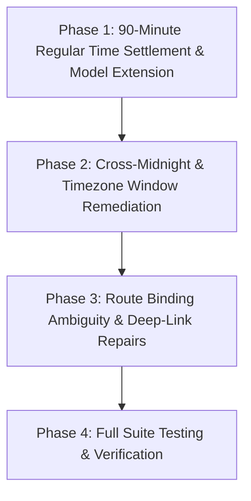

# Implementation Plan: 90-Minute Regular Time Settlement & Cross-Midnight Pipeline Remediation

## Executive Summary
This implementation plan resolves the core vulnerabilities identified across score updating, scraping, and settlement:
1. **90-Minute Regular Time Bet Settlement**: Guarantees that all betting tips (Straight Win/Draw, Over/Under, BTTS, Double Chance) are settled strictly on the 90-minute score (+ stoppage time) and never contaminated by Extra Time (AET) or Penalty Shootout (PEN) goals.
2. **Cross-Midnight & Date Boundary Handling**: Eliminates the 8 failure modes where late-night matches (spanning midnight, adjacent listing tabs, or UTC/WAT timezone offsets) fail to scrape or settle.
3. **Route Handler & Deep-Link Fixes**: Fixes the ambiguous Razor Pages `OnGetAsync` route handler collision on `/betslips` and enhances SportyBet slip deep linking.



---

## Phase 1: 90-Minute Regular Time Settlement & Model Extension (P0)

### Goal
Ensure all predictions, forecasts, and bet slips are judged and settled strictly on the 90-minute score card, preventing Extra Time and Penalties from corrupting settlement outcomes.

### Tasks

- [x] **1.1 Add `RegularTimeScore` to `MatchScore` Model**
  - **File:** `MatchPredictor.Domain/Models/MatchScore.cs`
  - **Action:** Add `public string? RegularTimeScore { get; set; }` to `MatchScore` entity.
  - **Verification:** Solution builds cleanly; `MatchScore` supports storing 90-minute regular time score distinct from full/extended match score.

- [x] **1.2 Extract Regular Time & Prevent AET Ingestion in FlashScore Parser**
  - **File:** `MatchPredictor.Infrastructure/WebScraperService.cs#L2100-L2135`
  - **Action:**
    - Update `ParseScoreDataHtml` and `MyRegex()` to inspect strings containing `aet`, `ET`, `Pen`, or subscores.
    - If FlashScore displays the 90-minute subscore in parentheses (e.g., `2-1 (1-1) aet`), extract `1:1` as `RegularTimeScore`.
    - If FlashScore shows an extra-time score without the 90-minute subscore, flag the row with `IsExtraTime = true` and do not populate `RegularTimeScore` with extra-time goals.
  - **Verification:** Unit test parsing `1-3aet`, `2-1 (1-1) aet`, and `1-1 (Pen: 5-6)` correctly isolates regular-time score.

- [x] **1.3 Compute 90-Minute Score from Period Arrays in AiScore JSON Parser**
  - **File:** `MatchPredictor.Infrastructure/WebScraperService.cs#L540-L590`
  - **Action:**
    - In `ParseAiScoreExtractedJson`, inspect `statusId` (8 = FT, 9 = AET, 10 = PEN).
    - When `statusId` is 9 or 10, calculate regular time score as Period 1 + Period 2 goals: `homeScores[1] + homeScores[2] : awayScores[1] + awayScores[2]`.
    - Store this in `AiScoreMatchScore.RegularTimeScore`.
  - **Verification:** Unit test verifying AiScore parser populates `RegularTimeScore` from periods 1 and 2 when match went to extra time.

- [x] **1.4 Enforce 90-Minute Settlement in `AnalyzerService.Settlement.cs`**
  - **File:** `MatchPredictor.Application/Services/AnalyzerService.Settlement.cs#L466-L485`
  - **Action:**
    - Pass `flashMatch.RegularTimeScore` into `ApplyFixtureSettlement`.
    - In `ResolveNinetyMinuteSettlementScore`, strictly prioritize `regularTimeScore`.
    - If a match is known to have concluded in extra time/penalties and `regularTimeScore` is missing from FlashScore, do NOT finalize settlement using the extra time score; defer to SofaScore/AiScore/API-Football fallback.
  - **Verification:** Integration test verifying that a 1-1 (FT) / 2-1 (AET) cup match settles as Draw and Under 2.5, NOT Home Win and Over 2.5.

---

## Phase 2: Cross-Midnight & Timezone Window Remediation (P0 / P1)

### Goal
Eliminate date-boundary blind spots so late-night, cross-midnight, and time-zone-shifted matches are reliably scraped, stored, and settled.

### Tasks

- [x] **2.1 Expand Settlement Database Query Window with $\pm 12$h Buffer & `MatchLocalDate` Fallback**
  - **File:** `MatchPredictor.Application/Services/AnalyzerService.Settlement.cs#L346-L348`, `L408`, `L497`
  - **Action:**
    - Widen `startOfWindowUtc` and `endOfWindowUtc` by $\pm 12$ hours (`startOfWindowUtc.AddHours(-12)` and `endOfWindowUtc.AddHours(12)`).
    - Query `MatchScores`, `AiScoreMatchScores`, and `SofaScoreMatchScores` using dual criteria:
      ```csharp
      (s.MatchTime >= startOfWindowUtc && s.MatchTime < endOfWindowUtc) ||
      (s.MatchLocalDate != default && settlementDates.Contains(s.MatchLocalDate))
      ```
    - Prevents matches kicking off past 23:00 UTC (midnight WAT) from being excluded by the strict query window.
  - **Verification:** Integration test verifying that scores stored with `MatchTime >= 23:00 UTC` are retrieved and settled for today's fixtures.

- [x] **2.2 Eliminate Hardcoded 2-Hour Day-Shift Bug in `ParseScoreMatchTime`**
  - **File:** `MatchPredictor.Infrastructure/WebScraperService.cs#L2207-L2215`
  - **Action:**
    - Replace `if (listing == today && parsedLocal > nowLocal.AddHours(2)) parsedLocal = parsedLocal.AddDays(-1);`
    - Anchor strictly to `listingDate` when provided.
    - If on today's listing, only adjust day offset if the row is verified finished and its kickoff hour indicates a prior-evening game ($h \ge 20$ and $nowLocal.Hour \le 4$).
    - Never shift upcoming or late-night scheduled fixtures into yesterday.
  - **Verification:** Unit test with `listing = today`, `nowLocal = 23:30`, and fixture kickoff `02:00` asserts the parsed date remains today/tomorrow, not shifted 24 hours back.

- [x] **2.3 Preserve Kickoff Timestamp for Live Scraped Scores**
  - **File:** `MatchPredictor.Infrastructure/WebScraperService.cs#L2190-L2196`
  - **Action:**
    - Do NOT overwrite `MatchTime = DateTime.UtcNow` when `isLive = true`.
    - Extract and parse the actual kickoff time from the listing row if available.
    - In `SaveMatchScores`, ensure existing record `MatchTime` is preserved so `MatchLocalDate` does not flip to tomorrow during live scraping.
  - **Verification:** Unit test asserting live match at 00:30 WAT retains scheduled kickoff date and doesn't create duplicate divergent rows.

- [x] **2.4 Include Tomorrow in `HasFixturesInLiveScrapeWindowAsync` and Scrape Listing Resolution**
  - **File:** `MatchPredictor.Application/Services/AnalyzerService.Settlement.cs#L125-L135`, `L265-L275`
  - **Action:**
    - Include `today.AddDays(1)` in `settlementDates` in `HasFixturesInLiveScrapeWindowAsync` when `nowUtc + LiveScrapeLead` reaches into tomorrow.
    - In `ResolveFlashScoreListingDatesAsync`, permit `today.AddDays(1)` when late-night upcoming fixtures exist in the lead window.
    - If current WAT time is between 00:00 and 06:00, always include `today.AddDays(-1)` in listing dates so yesterday's late-night finishes are scraped even if earlier Monday matches were settled.
  - **Verification:** Unit test asserting that at 23:45 WAT, fixtures scheduled for 00:15 WAT are included in the live scrape window.

- [x] **2.5 Expand `LiveScrapeTrail` from 3.5h to 4.5h**
  - **File:** `MatchPredictor.Application/Services/AnalyzerService.Settlement.cs#L121`
  - **Action:** Increase `LiveScrapeTrail` to `TimeSpan.FromHours(4.5)` so extended matches, extra time, penalty shootouts, and delayed evening fixtures do not cause the 15-minute scraper to switch to idle prematurely.
  - **Verification:** Unit test asserting a match 4 hours post-kickoff is still recognized within the live scrape window.

- [x] **2.6 Configure Explicit Timezone in Chrome Browser Options**
  - **File:** `MatchPredictor.Infrastructure/WebScraperService.cs#L2014-L2038`
  - **Action:** Add `--timezone=Africa/Lagos` to `ConfigurePrimaryScraperBrowserOptions`, `ConfigureAiScoreBrowserOptions`, and `ConfigureSofaScoreBrowserOptions` to guarantee consistent WAT clock rendering on all deployment hosts.
  - **Verification:** Scraper options include timezone argument.

- [x] **2.7 Multi-Date Query in API-Football Fallback**
  - **File:** `MatchPredictor.Infrastructure/WebScraperService.cs#L759-L780`
  - **Action:** In `FetchFromApiFootballAsync`, when running between 00:00 and 05:00 UTC, fetch fixtures for both `DateTime.UtcNow:yyyy-MM-dd` AND `DateTime.UtcNow.AddDays(-1):yyyy-MM-dd` so cross-midnight finishes are returned.
  - **Verification:** Unit test verifying multi-date query when current UTC time is near midnight.

---

## Phase 3: Route Binding Ambiguity & Deep-Link Repairs (P1)

### Goal
Fix the Razor Pages multiple handler route collision on `/betslips` and improve SportyBet slip deep links.

### Tasks

- [x] **3.1 Fix Ambiguous `OnGetAsync` Route Handler Parameter Order in `Betslips.cshtml.cs`**
  - **File:** `MatchPredictor.Web/Pages/Betslips.cshtml.cs#L43-L48`
  - **Issue:** `CancellationToken ct = default` is positioned before `string? run = null`, causing Razor Pages reflection to generate colliding handler signatures for `/betslips`.
  - **Action:** Move `CancellationToken ct = default` to the final parameter position:
    ```csharp
    public async Task OnGetAsync(
        string? record = null,
        DateOnly? date = null,
        string? month = null,
        string? run = null,
        CancellationToken ct = default)
    ```
  - **Verification:** Navigating to `/betslips` or clicking Selections renders without `InvalidOperationException: Multiple handlers matched`.

- [x] **3.2 Enhance SportyBet Slip Deep Link Fallback in `_BetslipCard.cshtml`**
  - **File:** `MatchPredictor.Web/Pages/Shared/_BetslipCard.cshtml`
  - **Action:** Ensure that if `BookingCode` is available (e.g. `GRP1MR`), the primary button uses `https://www.sportybet.com/ng/?shareCode={Model.BookingCode}` rather than falling back to the generic `/sport/football` landing page.
  - **Verification:** Clicking "Open in SportyBet" with a booking code opens SportyBet with the shareCode attached.

---

## Phase 4: Full Suite Testing & Verification (P0)

### Goal
Verify zero regressions, complete build pass, and 100% test success across all 378+ unit and integration tests.

### Tasks

- [x] **4.1 Run Unit Test Suite**
  - **Command:** `dotnet test MatchPredictor.Tests.Unit/`
  - **Verification:** All 346 unit tests pass with 0 errors.

- [x] **4.2 Run Integration Test Suite**
  - **Command:** `dotnet test MatchPredictor.Tests.Integration/`
  - **Verification:** All 437 integration tests pass with 0 errors.

- [x] **4.3 Run Master Audit Checklist**
  - **Command:** `python3 .agent/scripts/checklist.py .`
  - **Verification:** Security, Lint, Schema, Tests, UX, and SEO stages all pass.
